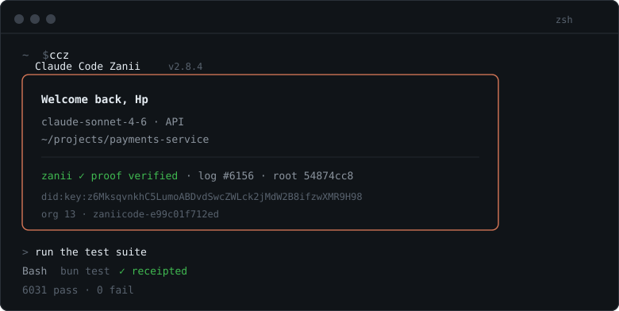
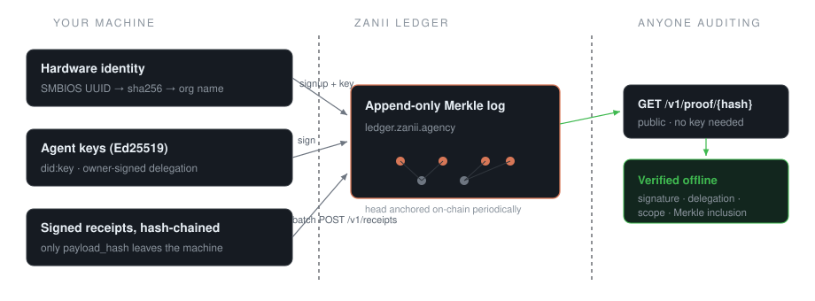

# Claude Code Zanii (CCZ)

[](https://github.com/vigilancetrent/claude-code-zanii/stargazers)
[](https://github.com/vigilancetrent/claude-code-zanii/graphs/contributors)
[](https://github.com/vigilancetrent/claude-code-zanii/issues)
[](https://github.com/vigilancetrent/claude-code-zanii/blob/main/LICENSE)
[](https://github.com/vigilancetrent/claude-code-zanii/commits/main)
[](https://bun.sh/)
[](https://discord.gg/uApuzJWGKX)

A fully restored, open build of Anthropic's [Claude Code](https://docs.anthropic.com/en/docs/claude-code) CLI — every core loop rebuilt in TypeScript on Bun, with the telemetry and lock-ins removed and a few things added that upstream doesn't have. Compatible with existing `CLAUDE.md` / `.claude` setups out of the box.

中文文档：[ccb.agent-aura.top](https://ccb.agent-aura.top/) · [社区项目留影](./Friends.md)



> **v2.12.0** — Harness parity with Claude Code 2.1.274: auto mode + fork mode by default, nested subagents, `/undo` `/focus` `/skill-doctor` `/import` `/deep-research`, `librarian` agent, repo map, `modelPricing` / `planModel`, effort on every provider, gateway routing headers, Hermes-style skill learning, 15 audit fixes. [What changed](docs/features/harness-parity-2026-09.md) · [Research](docs/harness-gap-research-2026-09.md)

## Proof of action

Every session can leave a verifiable trail. Claude Code Zanii integrates [Zanii](https://ledger.zanii.agency), a transparency log for AI agents: each tool call becomes a signed, hash-chained receipt in an append-only Merkle log that is periodically anchored on-chain. Only a **hash** of each action is stored — your code and file contents never leave the machine.

There is no signup form to fill. On first launch CCZ derives an identity from your hardware (SMBIOS UUID, so it survives OS reinstalls), registers an org named `zaniicode-<fingerprint>`, issues its own ingest key, and keeps everything under `~/.zaniicode/`. From then on, the banner shows live proof state:

```
zanii ✓ proof verified · log #6156 · root 54874cc8
```



**What this buys you.** Anyone — you, your client, an auditor — can take a receipt hash or export the full history at `https://ledger.zanii.agency/export/<agent DID>` and verify it offline: signature, delegation scope, Merkle inclusion, chain consistency. No trust in the server required. "What exactly did the agent run?" becomes a checkable question instead of a promise.

| File | Contents |
|---|---|
| `~/.zaniicode/zanii-account.json` | org id, admin key, `zk_live_` ingest key |
| `~/.zaniicode/zanii-agent.json` | Ed25519 agent keys, owner-signed delegation cert |

| Setting | Default | Meaning |
|---|---|---|
| `ZANII_PROOF` | on | set `0` to disable all ledger activity |
| `ZANII_API_KEY` | auto-provisioned | bring your own ingest key |
| `ZANII_SERVER_URL` | `https://ledger.zanii.agency` | point at your own log |

Receipts record *that* a tool ran and whether it succeeded — not what was in it. Full details: [`docs/features/zanii-proof.md`](docs/features/zanii-proof.md).

## What's inside

| | | |
|---|---|---|
| **Goal mode** — `/goal` drives the agent across turns until done; token budgets, pause/resume, blocked-attempt audits | **Ultracode orchestration** — deterministic JS workflows (`agent`/`pipeline`/`parallel`) with journal replay and a live monitor panel | **Multi-provider login** — Anthropic, Bedrock, Vertex, Foundry, plus OpenAI/Gemini/Grok-compatible endpoints via `/login` |
| **Remote Control** — self-hosted Docker control panel, run sessions from your phone ([docs](https://ccb.agent-aura.top/docs/features/remote-control-self-hosting)) | **ACP support** — first-class Zed/Cursor integration with session resume and permission bridging ([docs](https://ccb.agent-aura.top/docs/features/acp-zed)) | **Langfuse tracing** — inspect every agent-loop step, export runs as datasets ([docs](https://ccb.agent-aura.top/docs/features/langfuse-monitoring)) |
| **Pipe IPC & LAN swarm** — multi-instance collaboration on one machine or across the LAN ([docs](https://ccb.agent-aura.top/docs/features/uds-inbox)) | **Web search** — built-in Bing/Brave search tool ([docs](https://ccb.agent-aura.top/docs/features/web-browser-tool)) | **Computer & Chrome use** — screenshots, keyboard/mouse, browser automation ([docs](https://ccb.agent-aura.top/docs/features/computer-use)) |
| **Poor mode** — `/poor` cuts memory extraction and suggestions to slash request volume | **Channels** — push external messages into a session (Slack, Discord, 飞书, WeChat) ([docs](https://ccb.agent-aura.top/docs/features/channels)) | **Teach-me skill** — `/teach-me <topic>` walks you through this codebase Socratically |
| **Layered memory** — L1/L2/L3 distillation pipeline, provable writes via Zanii receipts, `/memory audit|list|clear` ([docs](https://ccb.agent-aura.top/docs/features/ccz-memory-plan)) | **Wiki-lite** — cross-link detection + PageRank keyword search across Magic Docs via `WikiSearchTool` ([docs](https://ccb.agent-aura.top/docs/features/wiki-lite)) | **Impact analysis** — callers/callees/blast radius via LSP or CodeGraph ([docs](https://ccb.agent-aura.top/docs/features/impact-analysis)) |
| **Skill promotion** — `/skill-promote` moves skills from project to user scope with semver versioning ([docs](https://ccb.agent-aura.top/docs/features/skill-promotion)) | **Team loadouts** — role-based memory filtering per agent with persistent registry ([docs](https://ccb.agent-aura.top/docs/features/team-loadouts)) | **CodeGraph** — incremental TS/JS indexer with mtime tracking + JSON persistence; `repoMap: true` injects a ranked symbol map into the prompt |
| **Auto mode by default** — classifier reviews every tool call; nested subagents (depth 3, cap 20); `/undo`, `/focus`, `/subtask`, `/list-agents`, `/skill-doctor` ([docs](docs/features/harness-parity-2026-09.md)) | **Any-provider parity** — `/effort` → `reasoning_effort` / Gemini `thinkingBudget`, `planModel` architect/editor split, `modelPricing` for honest `/cost`, gateway hint headers + [`model_gateway/`](model_gateway/README.md) router | **Skill learning** — Hermes-style closed loop (`/skill-learning start`); `librarian` agent for library docs; `postEditChecks` auto lint/test; `/import` from Cursor / Codex / Copilot |


## Install

```sh
npm i -g claude-code-zanii

ccz        # Node.js entry
ccz-bun    # Bun entry
ccz update
```

npm ≥ 11 may warn about `allow-scripts` and skip CCZ's postinstall. That's fine: CCZ fetches the ripgrep binary for your platform itself on first use (or uses a system `rg` if you have one). To silence the warning and let install scripts run up front:

```sh
npm config set allow-scripts=claude-code-zanii,@claude-code-best/mcp-chrome-bridge --location=user
```

If install or update misbehaves: `npm rm -g claude-code-best && npm i -g claude-code-zanii@latest`.

## Run from source

Requires [Bun](https://bun.sh/) ≥ 1.3.11 — use the newest version, older ones produce confusing failures.

```sh
# Linux / macOS
curl -fsSL https://bun.sh/install | bash
# Windows (PowerShell)
powershell -c "irm bun.sh/install.ps1 | iex"

git clone https://github.com/vigilancetrent/claude-code-zanii.git
cd claude-code-zanii
bun install

bun run dev     # dev mode — version ending in .888 means you're set
bun run build   # production bundle → dist/ (runs under both Bun and Node.js)
```

### First-run login

Type `/login` in the REPL and pick **Anthropic Compatible**, OpenAI, or Gemini. For the compatible path you'll need:

| Field | Example |
|---|---|
| Base URL | `https://api.example.com/v1` |
| API Key | `sk-xxx` |
| Haiku / Sonnet / Opus model IDs | `claude-haiku-4-5-20251001`, `claude-sonnet-4-6`, `claude-opus-4-6` |

Tab / Shift+Tab moves between fields, Enter confirms.

### Config home

CCZ uses `~/.zaniicode/` by default and never touches official Claude Code's `~/.claude` — settings, credentials, and session history stay separate even when both tools are installed. Project-level `.claude/` folders are still read, as usual. Override with `CLAUDE_CONFIG_DIR` if needed.

### Feature flags

Everything is compiled behind named flags, defaulting per build config:

```sh
FEATURE_BUDDY=1 FEATURE_GOAL=1 bun run dev
```

The registry lives in [`scripts/defines.ts`](scripts/defines.ts).

## Development

```sh
bun run typecheck    # strict tsc, must be clean
bun test             # 6000+ tests across ~450 files
bun run lint         # Biome
bun run precheck     # all of the above
bun run dev:inspect  # debugger for attach mode
```

TUI debugging needs a real terminal, so use attach: start `bun run dev:inspect`, then F5 → "Attach to Bun (TUI debug)" in VS Code with breakpoints set under `src/`.

Architecture notes and module map: [AGENTS.md](AGENTS.md) · [DeepWiki](https://deepwiki.com/vigilancetrent/claude-code-zanii)

## Contributors

<a href="https://github.com/vigilancetrent/claude-code-zanii/graphs/contributors">
  
</a>

## Star history

<a href="https://www.star-history.com/?repos=vigilancetrent%2Fclaude-code-zanii&type=date&legend=top-left">
 <picture>
   <source media="(prefers-color-scheme: dark)" srcset="https://api.star-history.com/image?repos=vigilancetrent/claude-code-zanii&type=date&theme=dark&legend=top-left" />
   <source media="(prefers-color-scheme: light)" srcset="https://api.star-history.com/image?repos=vigilancetrent/claude-code-zanii&type=date&legend=top-left" />
   
 </picture>
</a>

## Acknowledgments

- [doubaoime-asr](https://github.com/starccy/doubaoime-asr) — ASR SDK powering Voice Mode without Anthropic OAuth
- [Zanii](https://ledger.zanii.agency) — the transparency-log protocol behind proof of action

## License

For study and research only. Claude Code and all related rights belong to [Anthropic](https://www.anthropic.com/).
